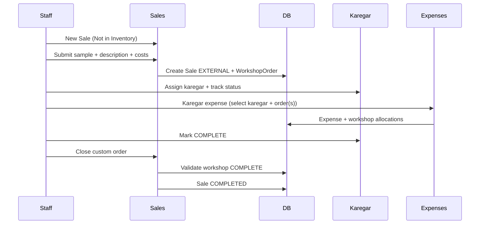
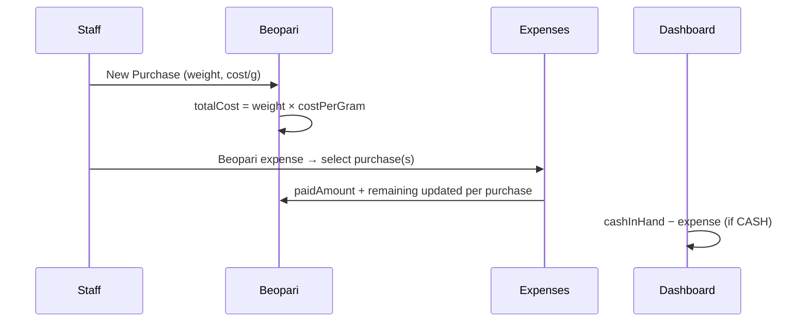

# Venus Silver Collection — Stage 2 Implementation Plan

> **Status:** Planning — not yet implemented  
> **Reference:** Stage 1 in [`implementation.md`](./implementation.md) and [`modules.md`](./modules.md)  
> **Task tickets:** [`modules_stage.md`](./modules_stage.md)  
> **Last updated:** June 14, 2026

---

## Table of Contents

1. [Executive Summary](#1-executive-summary)
2. [Stage 1 Baseline (What Exists Today)](#2-stage-1-baseline-what-exists-today)
3. [Stage 2 Goals & Scope](#3-stage-2-goals--scope)
4. [Cross-Module Architecture](#4-cross-module-architecture)
5. [Database Schema — Stage 2 Additions](#5-database-schema--stage-2-additions)
6. [Part A — Enhancements to Current Modules](#6-part-a--enhancements-to-current-modules)
7. [Part B — New Modules](#7-part-b--new-modules)
8. [Financial Model & Dashboard Metrics](#8-financial-model--dashboard-metrics)
9. [Workflow Diagrams](#9-workflow-diagrams)
10. [API Surface (New & Changed)](#10-api-surface-new--changed)
11. [UI / Navigation Changes](#11-ui--navigation-changes)
12. [Validation & Business Rules](#12-validation--business-rules)
13. [Migration Strategy](#13-migration-strategy)
14. [Recommended Implementation Order](#14-recommended-implementation-order)
15. [Testing Checklist (Stage 2)](#15-testing-checklist-stage-2)
16. [Open Decisions for Client Sign-off](#16-open-decisions-for-client-sign-off)

---

## 1. Executive Summary

Stage 1 delivered core shop operations: categories, stones, inventory, barcode sales, custom orders (inventory-backed), customers, dashboard metrics, and settings.

Stage 2 extends the product into a **full shop operating system** covering:

| Area | What changes |
|------|----------------|
| **Dashboard** | New Sale shortcut, richer recent-sales table, **Cash in Hand** card |
| **Customers** | Full purchase history per customer |
| **Sales** | Split flow: **In Inventory** vs **Not in Inventory** (sample-based external custom orders) |
| **Expenses** | Four types: **Beopari**, **Karegar**, **Shop**, **Home**; feeds dashboard & cash position |
| **Beopari (Vendor)** | Supplier ledger: purchases, total/paid/remaining, payments via Beopari expenses |
| **Karegar (Worker)** | Workshop queue for all custom orders; assignment, status, payments via Karegar expenses; **blocks sale close** until complete |

All modules must share one coherent financial and order lifecycle. No module should maintain duplicate totals — **ledger-style links** (Expense → BeopariPurchase / WorkshopOrder) are the source of truth for paid amounts.

---

## 2. Stage 1 Baseline (What Exists Today)

### Current pricing formula (post–Stage 1 stones work)

```
itemSuggestedPrice = ((todaySilverRate × weightGrams) + stonePrice) × qualityQuotient

qualityQuotient: PREMIUM → 4, LOCAL → 2 (configurable in Settings → Pricing)
minFinalPrice      = purchasePricePerGramAtInventory × weightGrams (= purchasePricePerPiece)
```

### Current sale types

| Type | Behavior |
|------|----------|
| `PURCHASE` | Immediate sale; inventory → `SOLD`; sale `COMPLETED` |
| `CUSTOM_ORDER` | Advance + pickup date; inventory → `RESERVED`; sale `OPEN`; close later |

### Current limitations Stage 2 must address

1. **Sales only work with inventory SKUs/barcodes** — no path for sample-only custom jobs.
2. **`SaleItem.inventoryItemId` is required** — blocks non-inventory orders.
3. **Custom order close** does not check workshop/production status.
4. **Customer module** lists customers but has no purchase history view.
5. **Dashboard recent sales** lacks item summary (category + stone); date column order wrong for client.
6. **No expense tracking** — net profit ignores operating costs; no cash-in-hand view.
7. **No supplier (Beopari) or worker (Karegar) ledgers.**

---

## 3. Stage 2 Goals & Scope

### In scope

- Dashboard UX improvements + Cash in Hand
- Customer purchase history (read-only, from sales)
- Sales dual-mode: In Inventory / Not in Inventory
- Expenses module (Beopari, Karegar, Shop, Home expense types)
- Beopari module with purchase ledger + Beopari expense payments
- Karegar module with workshop orders, assignment, status, payments
- Close-sale gate tied to Karegar `COMPLETE` status
- Dashboard metrics updated to incorporate expenses

### Out of scope (Stage 2)

- Multi-location / multi-shop
- Payroll beyond Karegar job payments
- Bank reconciliation (only cash-in-hand estimate)
- Customer portal / SMS notifications
- Partial Beopari purchase returns

---

## 4. Cross-Module Architecture

### 4.1 Entity relationship overview

```
Customer ─────┬──── Sale ─────┬──── SaleItem ──── InventoryItem
              │               │
              │               ├── WorkshopOrder ─── Karegar
              │               │         (custom orders only)
              │               │
              │               └── (EXTERNAL sale: sample image, description, manualCost)
              │
              └── (purchase history views)

Beopari ─── BeopariPurchase ─── ExpenseBeopariAllocation (Beopari expense)
Karegar ─── WorkshopOrder ─── ExpenseWorkshopAllocation (Karegar expense)

Expense (BEOPARI | KAREGAR | SHOP | HOME) ─── affects Dashboard cash & profit
  BEOPARI  → links beopari + one or more purchases; updates purchase remaining
  KAREGAR  → links karegar + one or more workshop orders; updates order payment totals
  SHOP     → required description (justification); cash in hand only
  HOME     → required description (justification); cash in hand only
```

### 4.2 Order lifecycle (custom orders)

```
┌─────────────────────────────────────────────────────────────────┐
│  CREATE CUSTOM ORDER (inventory or external)                     │
│    → Sale.status = OPEN                                          │
│    → WorkshopOrder auto-created, status = SENT_TO_WORKSHOP       │
└────────────────────────────┬────────────────────────────────────┘
                             ▼
┌─────────────────────────────────────────────────────────────────┐
│  KAREGAR MODULE                                                  │
│    Assign karegar → IN_PROGRESS (optional intermediate step)     │
│    Mark COMPLETE when piece is ready                             │
└────────────────────────────┬────────────────────────────────────┘
                             ▼
┌─────────────────────────────────────────────────────────────────┐
│  SALES — Close Custom Order                                      │
│    Allowed ONLY if WorkshopOrder.status = COMPLETE               │
│    → Collect remaining payment                                   │
│    → Sale.status = COMPLETED                                     │
│    → Inventory items → SOLD (if inventory-backed)                │
└─────────────────────────────────────────────────────────────────┘
```

### 4.3 Payment / ledger lifecycle (Beopari)

```
New Purchase (Beopari detail page)
  → BeopariPurchase.totalCost = weight × costPerGram (× qty if per-piece)
  → Beopari.totalAmount += totalCost
  → remainingAmount = totalAmount - paidAmount

Beopari Expense (select Beopari + one or more purchases)
  → Expense.amount allocated across selected BeopariPurchase rows
  → Each purchase paidAmount = SUM(allocations for that purchase)
  → Beopari.paidAmount recalculated from all linked allocations
  → remainingAmount updated; cash in hand reduced (if CASH)
```

Same pattern for **Karegar expenses** — amount allocated across selected workshop orders; karegar and per-order paid totals updated; cash in hand reduced (if CASH).

### 4.4 Single source of truth rules

| Metric | Formula | Source tables |
|--------|---------|---------------|
| **Monthly revenue** | Sum of `Sale.finalPrice` where `status = COMPLETED` in period | `sales` |
| **Monthly net profit (COGS)** | Sum(`SaleItem.finalPrice`) − Sum(`SaleItem.purchasePricePerPiece`) for completed sales | `sale_items` + `sales` |
| **Monthly net profit (operating)** | Net profit (COGS) − Sum(`Expense.amount`) in period | + `expenses` |
| **Cash in hand** | Cash inflows − Cash outflows (see §8) | `sales` + `expenses` |

Never store computed totals without a recalculation path — use DB aggregates or transactional updates on write.

---

## 5. Database Schema — Stage 2 Additions

### 5.1 New enums

```prisma
enum SaleSource {
  INVENTORY   // existing flow — SKU/barcode cart
  EXTERNAL    // sample-based custom order — no inventory items
}

enum ExpenseType {
  BEOPARI   // payment to supplier — linked to beopari + purchase(s)
  KAREGAR   // payment to worker — linked to karegar + workshop order(s)
  SHOP      // general shop operating expense — description required
  HOME      // personal/home expense drawn from shop cash — description required
}

enum WorkshopOrderStatus {
  SENT_TO_WORKSHOP
  IN_PROGRESS
  COMPLETE
}
```

### 5.2 Changes to existing models

#### `Sale`

```prisma
model Sale {
  // ... existing fields ...

  source SaleSource @default(INVENTORY)

  // EXTERNAL-only (nullable when source = INVENTORY)
  sampleImageData     String?  @map("sample_image_data") @db.Text
  sampleImageMimeType String?  @map("sample_image_mime_type")
  orderDescription    String?  @map("order_description") @db.Text
  manualCost          Decimal? @map("manual_cost") @db.Decimal(10, 2)

  workshopOrder WorkshopOrder?

  @@index([source])
}
```

**Rules:**

- `source = INVENTORY` → must have ≥1 `SaleItem` with valid `inventoryItemId`; external fields null.
- `source = EXTERNAL` → must have `orderDescription`, `manualCost`, `sampleImageData`; no `SaleItem` rows (or exactly one synthetic line — prefer **no SaleItem** and store totals on `Sale` only).
- `saleType` for EXTERNAL is always `CUSTOM_ORDER`.

#### `SaleItem`

```prisma
model SaleItem {
  inventoryItemId String? @map("inventory_item_id")  // nullable for future flexibility
  // ... rest unchanged ...
}
```

Add optional display snapshot for dashboard summaries:

```prisma
categoryName String? @map("category_name")  // denormalized for reports
```

Populate from `inventoryItem.category.name` + stone snapshot on sale create (already partially exists via stone fields).

### 5.3 New models

#### Expense

```prisma
model Expense {
  id            String        @id @default(uuid())
  expenseType   ExpenseType   @map("expense_type")
  amount        Decimal       @db.Decimal(10, 2)
  expenseDate   DateTime      @map("expense_date")
  description   String?       @db.Text   // required for SHOP/HOME; optional notes for BEOPARI/KAREGAR
  paymentMethod PaymentMethod @default(CASH) @map("payment_method")
  userId        String        @map("user_id")

  beopariId String? @map("beopari_id")   // required when expenseType = BEOPARI
  karegarId String? @map("karegar_id")   // required when expenseType = KAREGAR

  createdAt DateTime @default(now()) @map("created_at")
  updatedAt DateTime @updatedAt @map("updated_at")

  user                 User                        @relation(...)
  beopari              Beopari?                    @relation(...)
  karegar              Karegar?                    @relation(...)
  beopariAllocations   ExpenseBeopariAllocation[]
  workshopAllocations  ExpenseWorkshopAllocation[]

  @@index([expenseType])
  @@index([expenseDate])
  @@index([beopariId])
  @@index([karegarId])
  @@map("expenses")
}

model ExpenseBeopariAllocation {
  id                String  @id @default(uuid())
  expenseId         String  @map("expense_id")
  beopariPurchaseId String  @map("beopari_purchase_id")
  amount            Decimal @db.Decimal(10, 2)

  expense         Expense         @relation(...)
  beopariPurchase BeopariPurchase @relation(...)

  @@unique([expenseId, beopariPurchaseId])
  @@index([beopariPurchaseId])
  @@map("expense_beopari_allocations")
}

model ExpenseWorkshopAllocation {
  id              String  @id @default(uuid())
  expenseId       String  @map("expense_id")
  workshopOrderId String  @map("workshop_order_id")
  amount          Decimal @db.Decimal(10, 2)

  expense       Expense       @relation(...)
  workshopOrder WorkshopOrder @relation(...)

  @@unique([expenseId, workshopOrderId])
  @@index([workshopOrderId])
  @@map("expense_workshop_allocations")
}
```

**Expense type rules:**

| Type | Required fields | Ledger impact |
|------|-----------------|---------------|
| `BEOPARI` | `beopariId`, ≥1 purchase allocation | Updates purchase + beopari paid/remaining |
| `KAREGAR` | `karegarId`, ≥1 workshop order allocation | Updates per-order + karegar paid totals |
| `SHOP` | `description` (justification, min length) | Cash in hand + operating profit only |
| `HOME` | `description` (justification, min length) | Cash in hand + operating profit only |

**Allocation invariant:** `SUM(allocations.amount) === Expense.amount` for BEOPARI and KAREGAR types.

#### Beopari

```prisma
model Beopari {
  id                String   @id @default(uuid())
  name              String
  businessStartDate DateTime @map("business_start_date")
  notes             String?  @db.Text
  createdAt         DateTime @default(now()) @map("created_at")
  updatedAt         DateTime @updatedAt @map("updated_at")

  purchases BeopariPurchase[]
  expenses  Expense[]

  @@map("beoparis")
}
```

#### BeopariPurchase

```prisma
model BeopariPurchase {
  id           String   @id @default(uuid())
  beopariId    String   @map("beopari_id")
  categoryId   String?  @map("category_id")
  categoryName String   @map("category_name")  // snapshot if category deleted
  totalWeight  Decimal  @map("total_weight") @db.Decimal(10, 3)
  quantity     Int
  costPerGram  Decimal  @map("cost_per_gram") @db.Decimal(10, 2)
  totalCost    Decimal  @map("total_cost") @db.Decimal(10, 2)
  purchaseDate DateTime @default(now()) @map("purchase_date")
  notes        String?  @db.Text

  beopari      Beopari                    @relation(...)
  category     Category?                  @relation(...)
  allocations  ExpenseBeopariAllocation[]

  @@index([beopariId])
  @@map("beopari_purchases")
}
```

**Total cost formula:**

```
totalCost = roundPKR(totalWeight × costPerGram)
```

If business rules require `× quantity`, confirm with client (see §16). Default: weight is **total grams for the lot**; quantity is informational count of pieces.

**Paid / remaining (computed, not stored on Beopari header):**

```typescript
paidAmount = SUM(allocations.amount WHERE beopariPurchaseId = X)
remainingAmount = totalCost - paidAmount
```

Beopari list aggregates:

```typescript
totalAmount   = SUM(purchases.totalCost)
paidAmount    = SUM(beopariAllocations.amount across all purchases for beopari)
remainingAmount = totalAmount - paidAmount
```

#### Karegar

```prisma
model Karegar {
  id        String   @id @default(uuid())
  name      String
  phone     String?
  isActive  Boolean  @default(true) @map("is_active")
  createdAt DateTime @default(now()) @map("created_at")
  updatedAt DateTime @updatedAt @map("updated_at")

  workshopOrders WorkshopOrder[]
  expenses       Expense[]

  @@map("karegars")
}
```

#### WorkshopOrder

```prisma
model WorkshopOrder {
  id        String              @id @default(uuid())
  saleId    String              @unique @map("sale_id")
  karegarId String?             @map("karegar_id")
  status    WorkshopOrderStatus @default(SENT_TO_WORKSHOP)
  assignedAt DateTime?          @map("assigned_at")
  completedAt DateTime?         @map("completed_at")
  notes     String?             @db.Text
  createdAt DateTime             @default(now()) @map("created_at")
  updatedAt DateTime             @updatedAt @map("updated_at")

  sale        Sale                        @relation(...)
  karegar     Karegar?                    @relation(...)
  allocations ExpenseWorkshopAllocation[]

  @@index([status])
  @@index([karegarId])
  @@map("workshop_orders")
}
```

**Auto-create:** On every `CUSTOM_ORDER` sale (inventory or external), create `WorkshopOrder` with `SENT_TO_WORKSHOP`.

**Karegar payment tracking:**

- Payments recorded as `Expense` (`expenseType=KAREGAR`) with one or more `ExpenseWorkshopAllocation` rows.
- Karegar detail page shows sum of payments (all time + per order).
- Per-order paid = `SUM(workshopAllocations.amount WHERE workshopOrderId = X)`.

---

## 6. Part A — Enhancements to Current Modules

### 6.1 Dashboard (Module S2-A1)

#### 6.1.1 New Sale button

- **Placement:** Page header next to title, or prominent card in stats grid.
- **Action:** Navigate to `/dashboard/sales/new`.
- **Optional query param:** `?mode=inventory` (default) — external mode uses `?mode=external`.

#### 6.1.2 Recent sales table changes

**Current columns:** Invoice, Customer, Items, Status, Total, Date, Actions

**New column order:**

| Date | Invoice | Customer | Items Summary | Items | Status | Total | Actions |
|------|---------|----------|---------------|-------|--------|-------|---------|

**Items Summary column:**

- For inventory sales: comma-join per line: `{categoryName} ({stone snapshot or "No stone"})`
- For external sales: `{orderDescription truncated}` or `"Custom (sample order)"`
- API must return `itemsSummary: string` from `/api/dashboard/stats` (server-side formatting via `lib/sale-summary-utils.ts`).

#### 6.1.3 Cash in Hand card

See §8 — new metric `cashInHand` returned from stats API.

---

### 6.2 Customer module — Purchase history (Module S2-A2)

#### UX

- Customer table: add **View** action → `/dashboard/customers/[id]`
- Detail page sections:
  1. Customer info (name, phone, email, address) + Edit
  2. **Purchase history** table

#### Purchase history table columns

| Date | Invoice | Type | Source | Items / Description | Total | Paid | Status | Action |
|------|---------|------|--------|---------------------|-------|------|--------|--------|

- **Source:** In Inventory / Not in Inventory
- **Items / Description:** Same summary logic as dashboard
- **Paid:** For custom orders show `advancePaid` + remaining; for completed show full `finalPrice`
- Link to sale detail `/dashboard/sales/[id]`

#### API

- Extend `GET /api/customers/[id]` to include paginated `sales` with items, workshop status, summaries.
- Or new `GET /api/customers/[id]/purchases?page&limit`.

---

### 6.3 Sales module — Dual mode (Module S2-A3)

#### UI: Mode switch (top of New Sale page)

```
[ In Inventory ]  [ Not in Inventory ]   ← segmented control / toggle
```

State: `saleMode: 'INVENTORY' | 'EXTERNAL'` in URL or component state.

#### Mode: In Inventory (existing)

- No change to core flow: barcode, SKU, cart, purchase vs custom order.
- On custom order create → also create `WorkshopOrder`.

#### Mode: Not in Inventory (new)

**Hidden:** Barcode scanner, SKU input, cart multi-item flow.

**Shown:** Single-page custom order form:

| Field | Required | Notes |
|-------|----------|-------|
| Customer | Yes | Same selector as today |
| Sample image | Yes | Base64 upload, same validation as inventory images |
| Order description | Yes | Textarea — all job details |
| Manual cost (PKR) | Yes | User-entered COGS for dashboard/profit |
| Final sale price | Yes | Agreed customer price |
| Advance paid | Yes | Must be > 0 and < final price |
| Pickup date | Yes | Same as inventory custom order |
| Payment method | Yes | For advance |
| Notes | No | Internal notes |

**Sale type:** Locked to `CUSTOM_ORDER` only.

**API payload (new schema):**

```typescript
createExternalCustomOrderSchema = z.object({
  source: z.literal('EXTERNAL'),
  saleType: z.literal('CUSTOM_ORDER'),
  customerId: z.uuid(),
  sampleImageData: z.string().min(1),
  sampleImageMimeType: z.enum(['image/jpeg', 'image/png', 'image/webp']),
  orderDescription: z.string().min(10),
  manualCost: z.number().nonnegative(),
  finalPrice: z.number().positive(),
  advancePaid: z.number().positive(),
  pickupDate: z.string(),
  paymentMethod: paymentMethodEnum,
  notes: z.string().optional(),
})
```

**Post-create:**

- `Sale` with `source=EXTERNAL`, `status=OPEN`, `manualCost`, no `SaleItem`
- `WorkshopOrder` created automatically
- Redirect to sale detail + show workshop status banner

#### Close sale changes (both modes)

`POST /api/sales/[id]/close`:

1. Verify `saleType === CUSTOM_ORDER` && `status === OPEN`
2. **NEW:** Load `workshopOrder` — reject if `status !== COMPLETE`
3. Collect final payment (existing)
4. Mark sale `COMPLETED`, inventory → `SOLD` if inventory-backed

#### Invoice / sale detail for external orders

- Show sample image, description, manual cost, workshop status, karegar assigned
- Print layout adjusted for non-inventory line item

---

## 7. Part B — New Modules

### 7.1 Expenses module (Module S2-B1)

#### Sidebar

Add **Expenses** between Sales and Inventory (or after Dashboard — confirm in UI pass).

#### Pages

- `/dashboard/expenses` — list + filters (expense type, date range, beopari, karegar)
- `/dashboard/expenses/new` — create form
- `/dashboard/expenses/[id]` — view/edit/delete

#### Create expense form

**Step 1 — Expense type (required, drives the rest of the form):**

| Type | Label |
|------|-------|
| `BEOPARI` | Beopari Expense |
| `KAREGAR` | Karegar Expense |
| `SHOP` | Shop Expense |
| `HOME` | Home Expense |

**Common fields (all types):**

- Amount (PKR)
- Date
- Payment method (default CASH — important for cash-in-hand)

**When Beopari Expense:**

1. Select **Beopari** (dropdown from Beopari module)
2. Select **one or more open purchases** for that beopari (multi-select; each row shows category, date, total, remaining)
3. Enter total payment amount — optionally split per purchase (allocation rows); default: apply to first selected purchase up to its remaining, then next, etc.
4. Optional notes in description
5. **On save:** purchase paid/remaining recalculated; beopari aggregate totals updated; cash in hand reduced (if CASH)

**When Karegar Expense:**

1. Select **Karegar** (dropdown from Karegar module)
2. Select **one or more workshop orders** for that karegar (multi-select; shows invoice, customer, order description, amount already paid)
3. Enter total payment amount — optionally split per order (allocation rows)
4. Optional notes in description
5. **On save:** per-order and karegar paid totals updated; cash in hand reduced (if CASH)

**When Shop Expense or Home Expense:**

- **Description / justification** (required textarea, min 10 characters) — user must explain the expense
- No beopari or karegar linkage
- **On save:** operating profit and cash in hand reduced (if CASH)

#### List table columns

| Date | Type | Payee / Description | Amount | Payment Method | Actions |

- **Beopari/Karegar rows:** show payee name + linked purchase/order count
- **Shop/Home rows:** show truncated description

#### Dashboard impact

- **All four types** reduce **operating profit** and **cash in hand** (when `paymentMethod = CASH`)
- **Beopari** and **Karegar** types additionally update supplier/worker ledger remaining balances

---

### 7.2 Beopari (Vendor) module (Module S2-B2)

#### Pages

- `/dashboard/beopari` — list table
- `/dashboard/beopari/new` — add beopari
- `/dashboard/beopari/[id]` — detail + purchase history
- `/dashboard/beopari/[id]/purchases/new` — new purchase form

#### List table columns

| Name | Business Start | Total Amount | Paid | Remaining | Actions |

Aggregates computed from purchases + expenses (see §5.3).

#### New Purchase form fields

| Field | Notes |
|-------|-------|
| Category | Select from categories |
| Total weight (g) | Decimal |
| Quantity | Integer (pieces) |
| Cost per gram (PKR) | Decimal |
| Purchase date | Default today |
| Notes | Optional |

**Display:** `totalCost = weight × costPerGram` (live preview)

#### Integration with Expenses

- Recording payment: create **Beopari Expense** with `beopariId` + one or more `ExpenseBeopariAllocation` rows
- Beopari detail shows payment history (linked expenses + which purchases were paid)
- Cannot delete purchase if allocations linked (or soft-delete with warning)

---

### 7.3 Karegar (Worker) module (Module S2-B3)

#### Pages

- `/dashboard/karegar` — main view: custom orders queue + karegar list
- `/dashboard/karegar/workers/new` — add karegar
- `/dashboard/karegar/workers/[id]` — karegar profile + payment history
- `/dashboard/karegar/orders/[id]` — order detail (optional — may inline in main table)

#### Main table — Custom orders queue

| Date | Invoice | Customer | Source | Description / Items | Assigned To | Status | Sale | Actions |

- **Assigned To:** Dropdown of active karegars (PATCH updates `workshopOrder.karegarId`, sets `assignedAt`)
- **Status:** Dropdown: Sent to Workshop → In Progress → Complete
- **Source:** In Inventory / Not in Inventory (from `Sale.source`)

**Filters:** Status, karegar, date range

#### Add Karegar

- Name (required), Phone (optional), Active toggle

#### Payments

- From Karegar detail: "Record Payment" → opens expense form pre-filled as **Karegar Expense**
- From Expenses module: same linkage with karegar + workshop order multi-select
- Show total paid to karegar (all time / this month) and per-order paid from allocations

#### Sales integration

- Sale detail shows workshop block with status + assigned karegar (read-only or quick link to Karegar module)
- Close sale button disabled with tooltip until workshop `COMPLETE`

---

## 8. Financial Model & Dashboard Metrics

### 8.1 Updated dashboard cards

| Card | Stage 2 formula |
|------|-----------------|
| Available Inventory | unchanged |
| Sales This Month | unchanged |
| Revenue This Month | Sum completed `Sale.finalPrice` this month |
| Net Profit This Month | Sum(`SaleItem.finalPrice` − `SaleItem.purchasePricePerPiece`) + Sum(`EXTERNAL.manualCost` as cost) for completed sales − Sum(`Expense.amount`) this month |
| **Cash in Hand** | **see below** |
| Open Custom Orders | unchanged |

### 8.2 Cash in Hand (recommended definition)

Physical cash drawer estimate:

```
cashInHand =
  Sum(cash received from sales) − Sum(cash expenses)

Where:
  cash received = 
    COMPLETED sales where paymentMethod = CASH → finalPrice
    + OPEN/COMPLETED custom order advances where paymentMethod = CASH → advancePaid
    + custom order close payments where paymentMethod = CASH → remainingAmount collected at close

  cash expenses =
    All Expense where paymentMethod = CASH
```

**Note:** Card/UPI/Bank sales do not add to cash in hand — only `PaymentMethod.CASH`.

Store optional `openingCashBalance` in Settings for shift-based tracking (Stage 2.1 enhancement if client wants).

### 8.3 External order profit

For `EXTERNAL` completed sales:

```
profit = sale.finalPrice − sale.manualCost − karegarPaymentsLinked (optional attribution)
```

For dashboard net profit, use `manualCost` as COGS when no `SaleItem` rows exist.

---

## 9. Workflow Diagrams

### 9.1 External custom order end-to-end



### 9.2 Beopari purchase + payment



---

## 10. API Surface (New & Changed)

### 10.1 Changed endpoints

| Method | Path | Changes |
|--------|------|---------|
| GET | `/api/dashboard/stats` | Add `cashInHand`, `itemsSummary` on recent sales |
| GET | `/api/customers/[id]` | Include purchase history |
| POST | `/api/sales` | Support `source=EXTERNAL` payload; auto-create `WorkshopOrder` for custom orders |
| POST | `/api/sales/[id]/close` | Require `WorkshopOrder.status === COMPLETE` |

### 10.2 New endpoints

| Method | Path | Purpose |
|--------|------|---------|
| GET/POST | `/api/expenses` | List / create |
| GET/PUT/DELETE | `/api/expenses/[id]` | Detail / update / delete |
| GET/POST | `/api/beopari` | List / create beopari |
| GET/PUT/DELETE | `/api/beopari/[id]` | Detail / update / delete |
| GET/POST | `/api/beopari/[id]/purchases` | Purchase history / new purchase |
| GET/PUT/DELETE | `/api/beopari/purchases/[id]` | Purchase detail |
| GET/POST | `/api/karegar` | List karegars |
| GET/PUT | `/api/karegar/[id]` | Karegar detail |
| GET | `/api/workshop-orders` | Queue list (filters) |
| PATCH | `/api/workshop-orders/[id]` | Assign karegar, update status |

### 10.3 Shared libraries (new)

| File | Purpose |
|------|---------|
| `lib/sale-summary-utils.ts` | Format category+stone / external description for tables |
| `lib/expense-utils.ts` | Validate expense type rules, allocation sums, recalculate beopari/karegar paid totals |
| `lib/beopari-utils.ts` | `calculatePurchaseTotal`, aggregate ledger |
| `lib/workshop-utils.ts` | Status transitions, close-sale eligibility |
| `lib/cash-utils.ts` | Cash in hand aggregation |
| `lib/validations.ts` | Add schemas for all new entities |

---

## 11. UI / Navigation Changes

### Sidebar order (proposed)

1. Dashboard  
2. Sales  
3. **Expenses** *(new)*  
4. **Beopari** *(new)*  
5. **Karegar** *(new)*  
6. Inventory  
7. Categories  
8. Stones  
9. Customers  
10. Settings  

### New components (partial list)

```
components/dashboard/quick-actions.tsx
components/customers/customer-purchase-history.tsx
components/sales/sale-mode-switch.tsx
components/sales/external-order-form.tsx
components/sales/workshop-status-banner.tsx
components/expenses/expense-form.tsx
components/expenses/expense-allocation-fields.tsx
components/expenses/expense-table.tsx
components/beopari/beopari-table.tsx
components/beopari/purchase-form.tsx
components/karegar/workshop-queue-table.tsx
components/karegar/karegar-form.tsx
```

---

## 12. Validation & Business Rules

### 12.1 External custom orders

- `advancePaid < finalPrice`
- `advancePaid > 0`
- `manualCost >= 0`
- Sample image required (same 5MB base64 rules)
- `pickupDate` must be future date (or today — confirm client)

### 12.2 Workshop status transitions

Allowed:

```
SENT_TO_WORKSHOP → IN_PROGRESS → COMPLETE
SENT_TO_WORKSHOP → COMPLETE (skip in progress)
```

Not allowed: backward transitions without admin override (optional).

### 12.3 Close sale

- Workshop must be `COMPLETE`
- Remaining payment collected
- Inventory items (if any) must still be `RESERVED`

### 12.4 Expenses

- Amount > 0
- **Beopari:** `beopariId` required; ≥1 purchase selected; each allocation ≤ that purchase's remaining; `SUM(allocations) === expense.amount`
- **Karegar:** `karegarId` required; ≥1 workshop order selected; selected orders must belong to or be assignable to that karegar; `SUM(allocations) === expense.amount`
- **Shop / Home:** `description` required (min 10 chars) — justification mandatory; no payee links
- All types: reduce cash in hand when `paymentMethod = CASH`
- Cannot delete expense if it would break ledger — prefer void/reversal pattern (Stage 2: hard delete blocked if allocations exist)

### 12.5 Beopari purchases

- `totalWeight > 0`, `costPerGram >= 0`, `quantity >= 1`
- Category required

---

## 13. Migration Strategy

### Migration 1: `stage2_sales_source`

- Add `SaleSource` enum + columns on `Sale`
- Make `SaleItem.inventoryItemId` optional
- Add `categoryName` snapshot on `SaleItem`
- Backfill existing sales: `source = INVENTORY`

### Migration 2: `stage2_workshop`

- Add `WorkshopOrder`, `Karegar`, enums
- Backfill: for each open/completed `CUSTOM_ORDER`, create `WorkshopOrder` with status `COMPLETE` if sale already completed, else `SENT_TO_WORKSHOP`

### Migration 3: `stage2_beopari_expenses`

- Add `Beopari`, `BeopariPurchase`, `Expense` tables
- Add `ExpenseType` enum (BEOPARI, KAREGAR, SHOP, HOME)
- Add `ExpenseBeopariAllocation`, `ExpenseWorkshopAllocation` junction tables

### Data integrity

- Run migrations in dev → seed sample beopari/karegar/expenses for QA
- No production data loss — all additive

---

## 14. Recommended Implementation Order

| Phase | Modules | Rationale |
|-------|---------|-----------|
| **1** | S2-A1 Dashboard, S2-A2 Customer history | Low risk, client-visible quick wins |
| **2** | S2-A3 Sales dual mode + WorkshopOrder model | Core new sale type + karegar prerequisite |
| **3** | S2-B1 Expenses + cash metrics | Financial foundation for B2/B3 |
| **4** | S2-B2 Beopari | Depends on expenses |
| **5** | S2-B3 Karegar + close-sale gate | Depends on workshop orders + expenses |
| **6** | Integration QA | End-to-end flows, dashboard numbers |

---

## 15. Testing Checklist (Stage 2)

### Dashboard

- [ ] New Sale button opens sales page
- [ ] Recent sales: date first; items summary shows category+stone
- [ ] Cash in Hand updates when cash sale recorded
- [ ] Cash in Hand decreases on cash expense

### Customers

- [ ] Purchase history shows all customer sales
- [ ] External + inventory orders both appear

### Sales

- [ ] In Inventory mode unchanged
- [ ] Not in Inventory creates EXTERNAL sale + workshop order
- [ ] Cannot close until workshop COMPLETE
- [ ] Invoice shows sample image + description

### Expenses

- [ ] Shop expense with required description reduces cash/profit
- [ ] Home expense with required description reduces cash/profit
- [ ] Beopari expense updates purchase remaining (single and multi-purchase)
- [ ] Karegar expense appears on karegar detail and updates per-order paid totals

### Beopari

- [ ] New purchase increases total amount
- [ ] Payment via expense reduces remaining

### Karegar

- [ ] All custom orders appear in queue
- [ ] Assign + status change persists
- [ ] Close sale blocked until COMPLETE

---

## 16. Open Decisions for Client Sign-off

| # | Question | Default if no answer |
|---|----------|----------------------|
| 1 | Beopari `totalCost`: is it `weight × costPerGram` or `weight × costPerGram × quantity`? | `weight × costPerGram` (weight = total lot weight) |
| 2 | Cash in Hand: only `CASH` payment method? | Yes |
| 3 | Opening cash balance setting for start-of-day drawer? | Defer to Stage 2.1 |
| 4 | Can one expense split across multiple beopari purchases / workshop orders? | Yes — via allocation rows; total must equal expense amount |
| 5 | Delete/edit rules for expenses after posting? | Edit allowed same-day; delete blocked if linked |
| 6 | External orders: minimum advance percentage? | None — only advance < final |

---

*End of Stage 2 implementation plan.*
